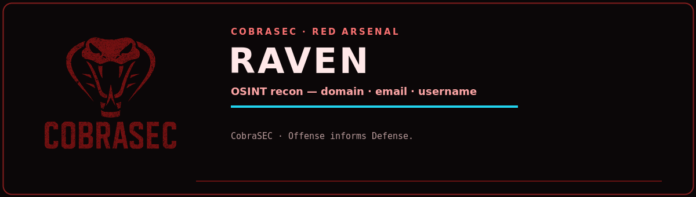

<p align="center">
  
</p>

# raven

OSINT starting point. Auto-detects what you give it - domain, email or username - and runs the right lookups: emails and subdomains for a domain, breach and registration exposure for an email, cross-platform accounts for a username.

## Install
Needs subfinder, holehe and sherlock on PATH.

## Usage
```
raven target.com          # emails + subdomains + exposure
raven user@target.com     # where it is registered / breached
raven jsmith              # accounts across platforms
raven target.com --json -o out
```

## Example
```
raven vulnweb.com
# 12 subdomains found
```
